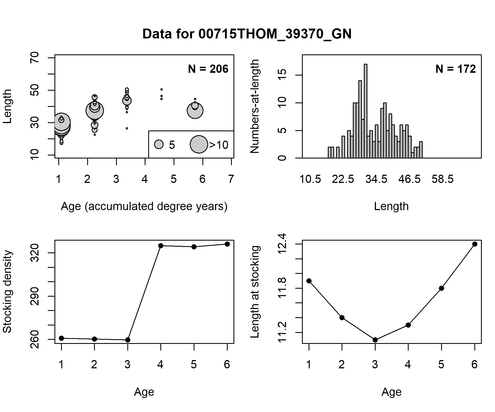
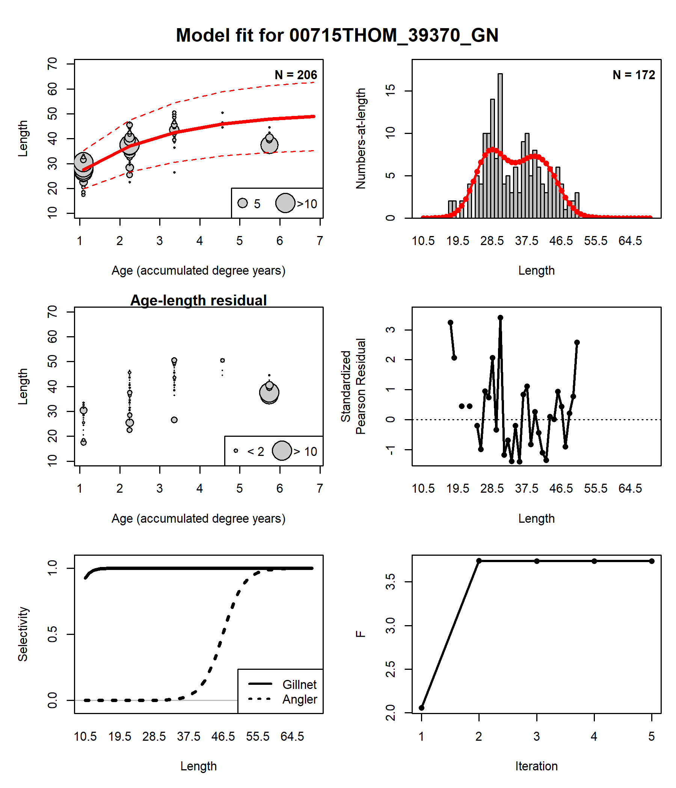
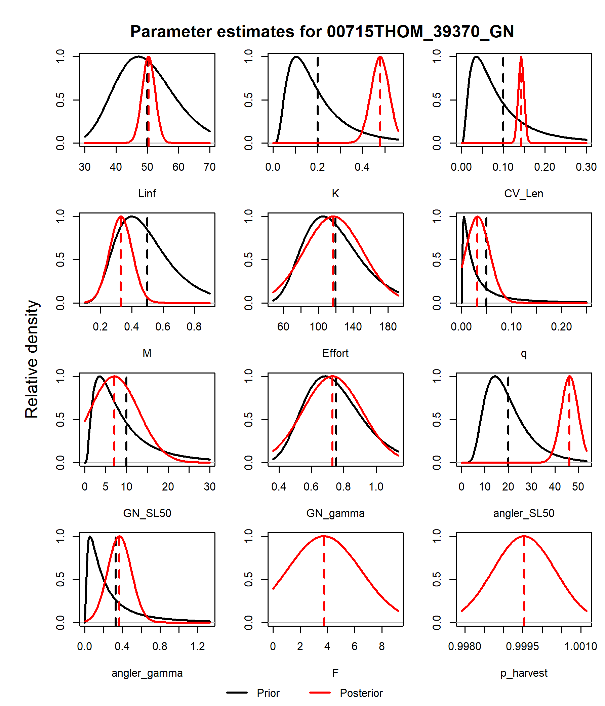
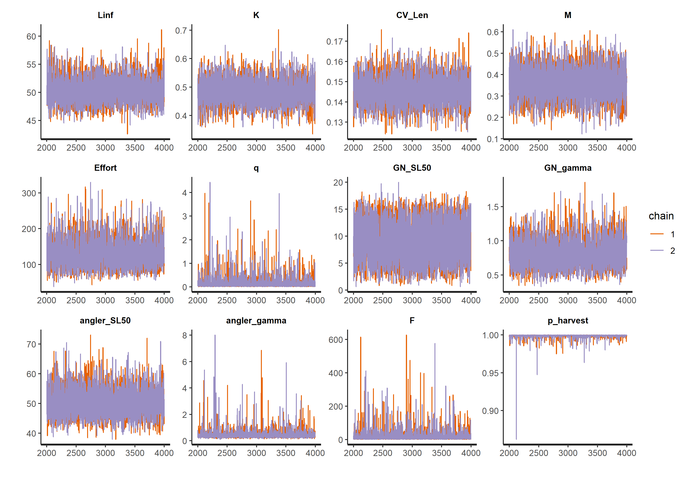

<script type="text/x-mathjax-config">
  MathJax.Hub.Config({ TeX: { equationNumbers: {autoNumber: "all"} } });
</script>

<style type="text/css">
h1 { /* Header 1 */
 font-size: 24px;
}
</style>

```{r setup, include = FALSE, echo = FALSE}
knitr::opts_chunk$set(
  collapse = TRUE,
  comment = "#>"
)

library(RBassess)
data(BC_lakes)
data_object <- BC_lakes[[69]]

```

# Introduction

This package is a stock assessment model primarily intended for rainbow trout (*Oncorhynchus mykiss*) stocked in small lakes in British Columbia, Canada. From an occasional gillnet survey, age and length samples are obtained, from which mortality, growth, and selectivity (assuming equilibrium) could be estimated. It is assumed that the stocking abundance and the length of fish at the time of stocking are known. 

This vignette provides a summary of the available features for fitting the model to data, along with an example application.

# Model description

The description of the assessment model can be obtained [here](assess.html).

# Importing data

The data can be imported into the package through a single S4 object of class `RBdata`.
```{r, eval = FALSE}
data_object <- new("RBdata")
```
The necessary entries and formats for data in the `RBdata` object can be found in the help page by typing `class?RBdata` in the R console. In summary, the following entries are needed:

- Either a vector of length comps (with corresponding midpoints of the length bins) or a matrix of age-length data (with length bins and integer ages)
- Lengths at stocking for each age in the model
- Accumulated growing degree days for each age in the model
- Bag limit
- Release mortality
- Priors for: growth parameters (Linf, K, CV), natural mortality, effort, catchability, gillnet selectivity, angler selectivity

Lognormally-distributed priors are used here for all parameters. Users should provide a vector of length-2 for the prior mean and standard deviation. For example, `data_object@prior_Linf <- c(50, 10)` corresponds to mean of 50 and s.d. of 10 for the Linf prior.

For the rest of this vignette, let's take a look at the `BC_lakes` dataset, specifically the 69th entry in the list.

```{r, eval = FALSE}
data(BC_lakes)
data_object <- BC_lakes[[69]]
plot(data_object)
```


The plot function for the `RBdata` object shows some of the important data inputs, e.g., length and age observations, stocking density, and mean length at stocking.

# Estimating posterior mode

From the `RBdata` object, the model can be fit with the `fit_model` function:
```{r}
model <- fit_model(data_object)
```
The point estimates from the model are the posterior modes the conditional on the priors provided in the `RBdata` object. 

```{r}
summary(model)
```
The `fit_model` function returns a `RBfit` object and a `plot` method has been written for `RBfit`. The plot function returns two diagnostic plots, so let's take a look at them:
```{r, eval = FALSE}
plot(model)
```


The first plot shows fits to the data, along with residuals. In this dataset, there were 206 age-length samples and 172 length samples. The first row shows the observed data (grey) as well as predicted model fits (red). The second row shows the residuals from the corresponding column in the first row. The left column in the third row shows the estimated selectivity of the gillnet survey and of the anglers.

Finally, the right column of the third row shows a convergence diagnostic for fishing mortality (F). In the model, F is solved iteratively (see the [model description](assess.html)). The value of F should stabilize as the iterations increase. By default, five iterations (for each evaluation of the likelihood function) is used to solve for F. Otherwise, more iterations may be needed and can be done by increaseing the value of the `nit_harvest` argument in the `fit_model` function.



This next figure shows the priors and posterior mean from the model. The distributions for the parameters are stylized. A lognormal distribution is shown for the prior given the standard deviation from the `RBdata` object while a normal approximation is shown for the posterior given the standard deviation from the estimated Hessian matrix.

From the two figures above, the model is estimating a very high F, but only for the largest animals in the population. The anglers seem to only be fishing hard for and keeping all of the largest animals, which could indicate a trophy fishery in this lake. This is based on the complete absence of animals larger than 50 cm in the survey. Growth parameters appear to be well estimated from the data, based on the low variance of the Linf, K, and CV posteriors compared to their respective priors.

# MCMC sampling
`RBassess` uses the `rstan` package to run the MCMC sampling of the posterior distribution. This is done by calling `run_mcmc` and passing the `RBfit` object:
```{r eval = FALSE}
samps <- run_mcmc(model)
summary(samps)
```

MCMC specifications such as the number of iterations for thinning and warmup are specified in `run_mcmc`. Here are the posterior means and standard deviations from our model:

```{r echo = FALSE}
res <- read.csv('mcmc_summary.csv')

res_show <- res[, -1]
rownames(res_show) <- res[, 1]
round(res_show, 2)
```

All diagnostic plots available in `rstan` can be used here. For example, we can get a trace plot from our MCMC chain:
```{r eval = FALSE}
rstan::stan_trace(samps)
```



Information on additional plots are available in the documentation `rstan`. A Shiny app interface is also available with `shinystan::launch_shinystan`.

It is also good practice to sample the priors and compare them to the posteriors:
```{r eval = FALSE}
samps_prior <- run_mcmc(model, priors_only = TRUE)
plot(samps, samps_prior)
```


Here we can see both the sampled prior and posterior distributions from `rstan`.

# Reporting

Finally, the `report` function can be used to generate from a `RBfit` or `rstan` output.

```{r eval = FALSE}
report(model)
report(samps)
```


# Acknowledgements

Work on this package was funded by a contract from the Ministry of Environment of the Province of British Columbia.

